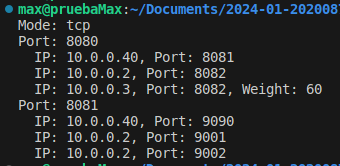
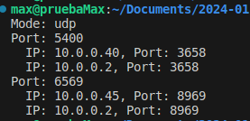
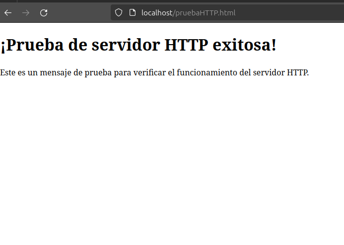
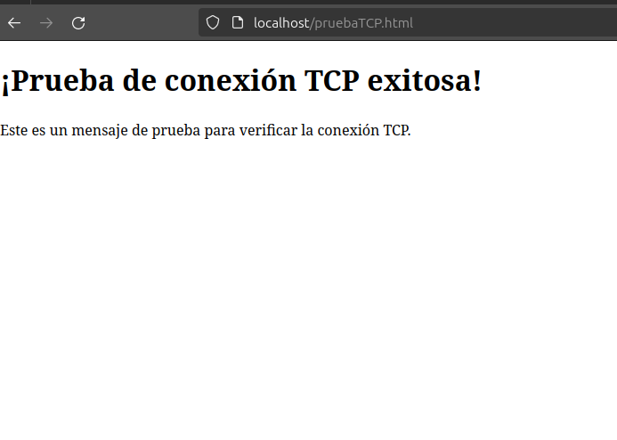

### Instituto Tecnológico de Costa RIca
### Redes-IC-7602
### Profesor: Nereo Campos
### Proyecto 1
### Maximo Agrazal Quirós 2020087577
### Fecha de entrega: 27/04/2024


## Instrucciones para ejecución
Para poder correr  este proyecto, primero necesitaremos tener instalado Git, Docker, Helm y Kubernetes en nuestro ambiente, preferiblemente en Linux. Si no los tienes, sigue los siguientes pasos para instalarlos:

### instalación de Git en Ubuntu
Para instalar git si aún no lo tenemos solamente será correr el siguiente comando en una terminal:
1. ```bash
   sudo apt install git
   ```
Para comprobar que todo haya salido bien solo confirmamos la versión que tenemos en nuestro sistema:

2. ```bash
    git --version
    ```

### Instalación de Docker en Ubuntu
Para comenzar, necesitaremos instalar Docker en nuestro sistema Ubuntu. Sigue estos pasos:

1. **Actualizar el índice de paquetes:**
   ```bash
   sudo apt update
   ```
2. **Instalar paquetes previos necesarios:**
   ```bash
   sudo apt install apt-transport-https ca-certificates curl software-properties-common
   ```
3. **Descargar e importar la clave GPG oficial de Docker:**
   ```bash
   curl -fsSL https://download.docker.com/linux/ubuntu/gpg | sudo apt-key add -
   ```
4. **Agregar el repositorio de Docker al sistema:**
   ```bash
   sudo add-apt-repository "deb [arch=amd64] https://download.docker.com/linux/ubuntu $(lsb_release -cs) stable"
   ```
5. **Actualizar el índice de paquetes nuevamente:**
   ```bash
   sudo apt update
   ```
6. **Instalar la versión comunitaria de Docker (docker-ce):**
   ```bash
   sudo apt install docker-ce
   ```

7. **Verificar que Docker se haya instalado correctamente:**
   ```bash
   sudo docker --version
   ```

8. **Agregar tu usuario al grupo `docker`:**
   ```bash
   sudo usermod -aG docker $USER
   ```
   Después de esto, cierra sesión e inicia sesión nuevamente o ejecuta:
   ```bash
   newgrp docker
   ```

### Instalación de Helm en Ubuntu

Ahora instalaremos Helm, una herramienta útil para la gestión de aplicaciones en Kubernetes. Sigue estos pasos:

1. **Descargar el script de instalación de Helm:**
   ```bash
   curl -fsSL -o get_helm.sh https://raw.githubusercontent.com/helm/helm/master/scripts/get-helm-3
   ```

2. **Hacer que el script sea ejecutable:**
   ```bash
   chmod 700 get_helm.sh
   ```

3. **Ejecutar el script de instalación:**
   ```bash
   ./get_helm.sh
   ```

4. **Verificar que Helm se haya instalado correctamente:**
   ```bash
   helm version
   ```

### Instalación de Kubernetes en Ubuntu usando kubeadm

Finalmente, instalaremos Kubernetes en nuestro sistema Ubuntu utilizando kubeadm. Aquí tienes los pasos:

1. **Seguir la guía oficial de Kubernetes para instalar kubeadm, kubelet y kubectl:**
   ```bash
   sudo apt update
   sudo apt install -y apt-transport-https curl
   curl -s https://packages.cloud.google.com/apt/doc/apt-key.gpg | sudo apt-key add -
   echo "deb https://apt.kubernetes.io/ kubernetes-xenial main" | sudo tee /etc/apt/sources.list.d/kubernetes.list
   sudo apt update
   sudo apt install -y kubelet kubeadm kubectl
   sudo apt-mark hold kubelet kubeadm kubectl
   ```

2. **Inicializar un clúster de Kubernetes utilizando kubeadm:**
   ```bash
   sudo kubeadm init
   ```

3. **Seguir las instrucciones proporcionadas por kubeadm después de la inicialización. Por ejemplo, configurar `kubectl` para que utilice el clúster recién creado:**
   ```bash
   mkdir -p $HOME/.kube
   sudo cp -i /etc/kubernetes/admin.conf $HOME/.kube/config
   sudo chown $(id -u):$(id -g) $HOME/.kube/config
   ```

4. **Verificar el estado del clúster de Kubernetes:**
   ```bash
   kubectl cluster-info
   ```

Ahora ya debemos tener Docker, Helm y un clúster de Kubernetes funcionando para correr el proyecto. Vamos a empezar por clonar el repositorio del proyecto. Una vez hecho esto deberemos abrir una terminal en el directorio "helmcharts" del proyecto, y ahí colocamos lo siguiente para hacer el deployment:
```bash
    helm upgrade --install helmchart helmchart
   ```
#### Pruebas realizadas
Dentro de las pruebas que se realizaron para este proyecto, tenemos las pruebas de lectura o parseo con la aplicacion del proxy en C. Para realizar estas pruebas se utilizaron los archivos prueba brindados por el profesor del curso. 

Debemos asegurarnos de que nuestro deploy esté trabajando, y dentro de la terminal, y con correr el comando de ./myapp corremos nuestro proxy.

A continuación, los resultados de nuestras pruebas con los distintos archivos.
#### HTTP

#### TCP

#### UDP


Si entramos a nuestra carpeta de tests->archivos_prueba, podremos encontrar los json con que se hicieron estas pruebas y verificar los resultados obtenidos.

Ahora que tenemos nuestro proxy funcionando, debemos realizar las pruebas de carga que deberan redirigir los request a los servidores indicados en el config.json. Dado que estoy teniendo algunos problemas con la conexión de las partes, mostraré como se debe ver las pantallas una vez hayan sido redirreccionadas.

Hacia HTTP se vería así:


Hacia TCP se vería así:



### Recomendaciones

1. **Realiza una planificación:** Es clave realizar una planificación al iniciar un proyecto, definiendo claramente los objetivos, alcance y recursos necesarios.
  
2. **Uso de control de Git:** Emplear herramientas como Git y GitHub facilita el seguimiento de cambios en el código fuente.
  
3. **Automatización de pruebas:** Implementar pruebas automatizadas ayuda a detectar errores tempranos y es una gran manera de evitar realizar pruebas manualmente.
  
4. **Documentación interna y externa :** Tanto la documentación interna como externa son importantes en un proyecto de software.
  
5. **Investigar exhaustivamente:** Priorizar el conocimiento de las tecnologías antes de empezar, puede ayudar a que el flujo de trabajo sea más normal y evita atascos.
  
6. **Tener un roadmap:** Al empezar un proyecto, tener un roadmap de todas las tareas y lo necesario para realizarlas es muy útil.
  
7. **Desarrollar con escalabilidad:** Diseñar la aplicación pensando en la escalabilidad garantiza que pueda crecer con mayor facilidad.
  
8. **Desarrollo Continuo:** Asignar recursos para el mantenimiento asegura que el proyecto permanezca funcional y actualizado después del lanzamiento.
  
9. **Aprendizaje para el trabajo:** A pesar de que es un proyecto de la universidad, el conocimiento adquirido con este es muy útil en el campo laboral, por lo que intentar hacerlo lo mejor posible.
  
10. **Autoevaluarse:** Realizar evaluaciones retrospectivas al final del proyecto identifica lecciones aprendidas y áreas de mejora .

### Conclusiones

1. **Aprendizaje constante:** El proyecto me permitió adquirir conocimientos sobre tecnologías muy utiles en redes.
  
2. **Desafío personal:** Trabajar solo en el proyecto fue un reto que me ayudó a aprender más de las tecnologías utilizadas.

3. **Responsabilidad:** Tuve la libertad de tomar decisiones y asumir la responsabilidad sobre el resultado final del proyecto.

4. **Flexibilidad:** Aprendí a adaptarme a cambios en el plan inicial y enfrentar problemas de manera flexible.

5. **Habilidades técnicas:** Mejoré mis habilidades en dockers, kubernetes, apache, etc.

6. **Gestión del tiempo:** La organización del tiempo fue crucial para lograr desarrollar el proyecto.

7. **Creatividad:** Exploré distintas soluciones para resolver problemas  como el del proxy en C.

8. **Compromiso:** Mantuve mi compromiso para superar obstáculos y lograr desarrollar este proyecto.

9. **Reconocimiento de areas de  mejora:** Reconozco que el proyecto pudo haber sido completado con una mejor organización del tiempo y de los recursos.

10. **Repaso de habilidades:** Durante el desarrollo del proxy, pude volver a utilizar mis habilidades en C, que tenía tiempo sin utilizar.